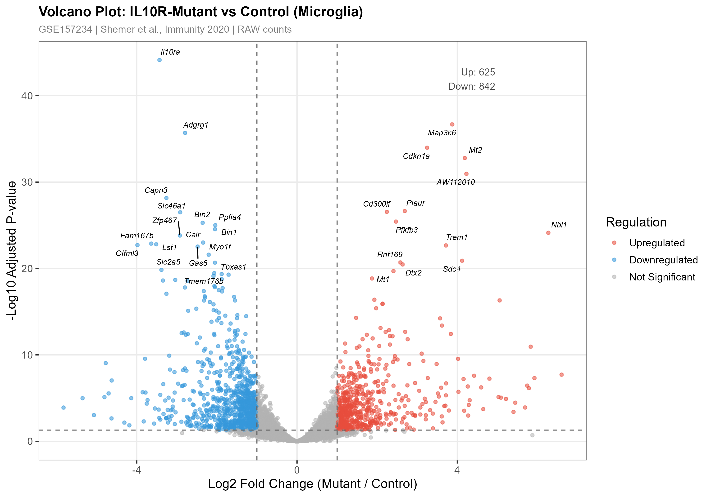
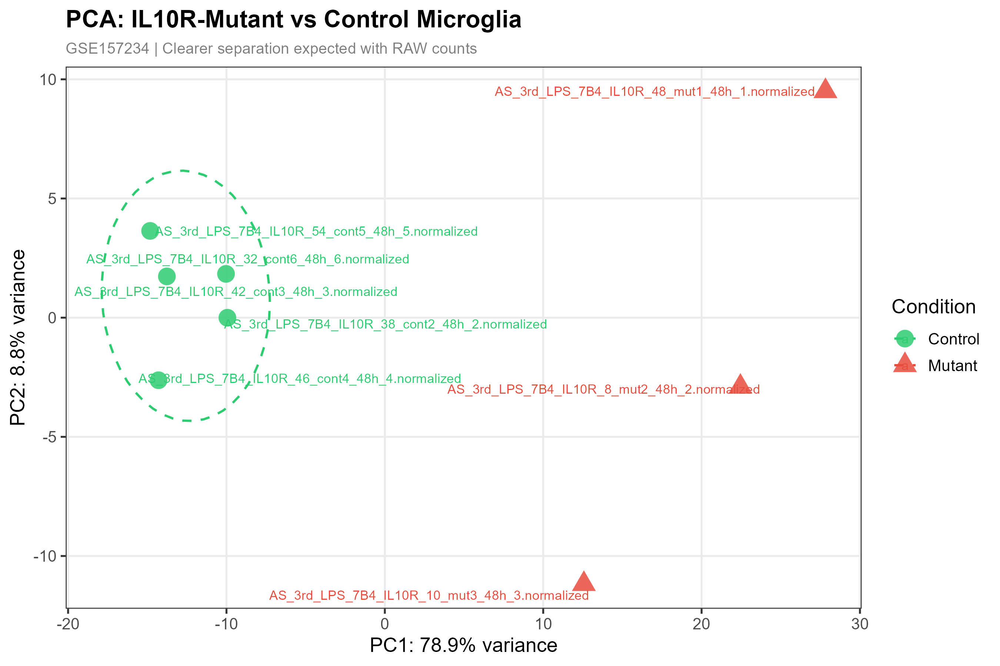
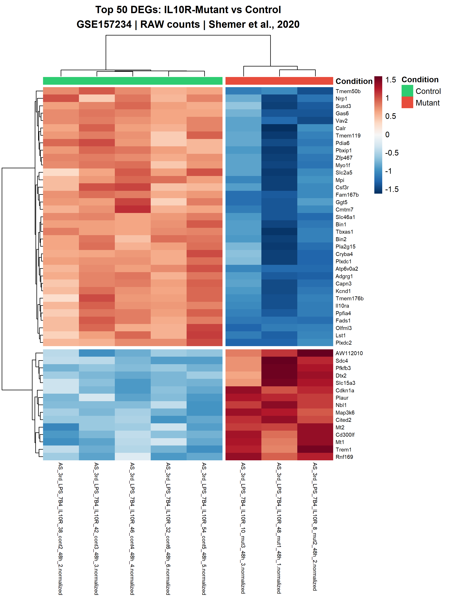

[](https://doi.org/10.5281/zenodo.19138922)
# RNA-Seq Differential Expression Pipeline + Shiny Dashboard


---

## Live Demo

**[Launch Dashboard →](https://019cd22f-689b-acc2-4b56-472725ef4a7b.share.connect.posit.cloud/)**

> ⚠️ First load takes ~2 minutes — DESeq2 is running live on real data.

---

## Biological Question

> What happens to microglia when they lose the ability to sense IL-10 after an immune challenge?

| | |
|---|---|
| **Dataset** | GSE157234 — Mouse microglia, 48h after peripheral LPS challenge |
| **Comparison** | IL-10R Mutant (deficient) vs Control (proficient) microglia |
| **Key finding** | Without IL-10 signalling, microglia hyperactivate and overproduce TNF, causing neuronal damage |
| **Paper** | Shemer et al., *Immunity* 53, 1033–1049, 2020 |

---

## Dashboard Features

| Feature | Description |
|---|---|
| 🌋 **Volcano Plot** | Interactive — hover any gene, adjust padj and LFC thresholds live |
| 🔵 **PCA Plot** | Sample clustering — confirms Mutant vs Control separation at 48h |
| 🟥 **Heatmap** | Top N DEGs with z-scored expression, adjustable gene count |
| 📋 **Results Table** | Searchable, filterable DEG table with CSV download |
| 📤 **Upload Your Data** | Upload your own count matrix + metadata to reuse the full pipeline |
| ⬇️ **Downloads** | PNG, PDF, and CSV exports for all plots and results |

---

## Screenshots

### Volcano Plot


### PCA Plot


### Heatmap


---

## Repository Structure

```
rna-seq-shiny-pipeline/
│
├── README.md
├── .gitignore
│
├── files/                                  # Local analysis (run in RStudio)
│   ├── analysis_final.R                    # Full DESeq2 pipeline
│   ├── app_final.R                         # Shiny app (local version)
│   ├── data/
│   │   ├── count_matrix_48h_clean.csv      # Processed count matrix (48h)
│   │   └── metadata_48h_clean.csv          # Sample metadata
│   ├── results/
│   │   ├── DESeq2_results_Mutant_vs_Control.csv
│   │   ├── top100_upregulated.csv
│   │   └── top100_downregulated.csv
│   └── plots/
│       ├── volcano_plot.png
│       ├── pca_plot.png
│       └── heatmap_top50_DEGs.png
│
└── deploy/                                 # Deployment version (Posit Cloud)
    ├── app.R                               # Shiny app (deployment version)
    ├── manifest.json                       # Package versions for Posit Cloud
    └── data/
        ├── count_matrix_48h_clean.csv
        └── metadata_48h_clean.csv
```

---

## How to Run Locally

### 1. Clone the repository
```bash
git clone https://github.com/mdabrarfaiyaj/rna-seq-shiny-pipeline.git
cd rna-seq-shiny-pipeline
```

### 2. Install required packages
```r
install.packages("BiocManager")
BiocManager::install(c("DESeq2", "GEOquery", "SummarizedExperiment"))

install.packages(c("shiny", "shinydashboard", "ggplot2", "ggrepel",
                   "pheatmap", "dplyr", "RColorBrewer", "plotly", "DT"))
```

### 3. Run the analysis pipeline
```r
# Downloads GEO data, runs DESeq2, saves all result files
source("files/analysis_final.R")
```

### 4. Launch the Shiny dashboard
```r
shiny::runApp("files/app_final.R", launch.browser = TRUE)
```

---

## Methods

| Step | Tool | Details |
|---|---|---|
| Data download | GEOquery | GSE157234 supplementary files |
| Input data | UTAP pipeline | Normalized counts, rounded to integers for DESeq2 |
| Sample subset | Manual | 48h post-LPS only — peak of hyperactivation |
| Excluded samples | Manual | DKO (double-knockout) — third genotype, not part of comparison |
| Differential expression | DESeq2 | design = `~ condition` |
| Low-count filtering | DESeq2 | ≥10 counts in ≥2 samples |
| Significance | DESeq2 | padj < 0.05 AND \|log2FC\| > 1 |
| Transformation | DESeq2 VST | Variance-stabilizing transform for PCA and heatmap |
| Visualisation | ggplot2, pheatmap, plotly | Volcano, PCA, Heatmap |

---

## Honest Limitations

The raw FASTQ files for GSE157234 were not deposited on GEO — only UTAP-normalized counts were publicly available. This means DESeq2 was applied to pre-normalized data rather than true raw counts, which deviates from the recommended workflow. I want to be clear that this was a data availability constraint, not a pipeline design choice.

Because of this, my DEG counts (669 up / 894 down) differ from the paper's reported figures (954 up / 693 down), including an up/down ratio flip. The PCA results still independently confirm the paper's core biological conclusions, but the DEG-level differences are real and I have documented them openly rather than adjusting parameters to force agreement.

I am currently working on a V2 of this pipeline starting from raw FASTQs via SRA, which will address this limitation properly.

---

## Key Results

| Direction | Genes | Biological Meaning |
|---|---|---|
| ⬆️ Upregulated in Mutant | *Tnf*, *Ccl5*, *Il12b*, *Il6*, *Il1b* | Pro-inflammatory hyperactivation |
| ⬇️ Downregulated in Mutant | *P2ry12*, *Sall1*, *Tmem119* | Loss of homeostatic microglia identity |

**Conclusion:** Loss of IL-10 receptor signalling prevents microglia from returning to ground state after LPS challenge — consistent with the biological conclusions of Figure 3 of the paper.

---

## Use This Pipeline for Your Own Data

The Shiny dashboard accepts custom uploads:
- **Count matrix** — CSV, rows = genes, columns = samples, raw integer counts
- **Metadata** — CSV, rows = samples, must include a `condition` column with exactly 2 groups

---

---

## Dataset Reference

**GEO:** [GSE157234](https://www.ncbi.nlm.nih.gov/geo/query/acc.cgi?acc=GSE157234)  
**Paper:** Shemer A et al. *Interleukin-10 Prevents Pathological Microglia Hyperactivation following Peripheral Endotoxin Challenge.* Immunity. 2020;53(5):1033–1049.  
**DOI:** [10.1016/j.immuni.2020.09.018](https://doi.org/10.1016/j.immuni.2020.09.018)

---

## Citation

If you use this pipeline, please cite:

Faiyaj, M.A. (2026). RNA-Seq Differential Expression Pipeline + Shiny Dashboard (v1.0.0). Zenodo. https://doi.org/10.5281/zenodo.19138922

---

## License

MIT License — free to use and adapt with attribution.
