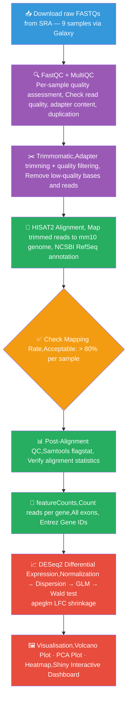

# RNA-Seq Differential Expression Pipeline + Shiny Dashboard


A complete, reproducible RNA-Seq differential expression analysis pipeline with an interactive Shiny dashboard. Built by independently replicating **Shemer et al., Immunity 2020** from raw sequencing data.

---

## 🚀 Live Demo

**[Launch V2 Dashboard →](https://019cd22f-689b-acc2-4b56-472725ef4a7b.share.connect.posit.cloud/)**

> ⚠️ First load takes ~2 minutes — DESeq2 is running live on real data.

---

## 🧬 Biological Question

> What happens to microglia when they lose the ability to sense IL-10 after an immune challenge — and which genes drive that failure?

More precisely: which genes fail to return to baseline in **IL-10R deficient (Mutant) microglia** compared to **controls** at **48h post-LPS** — the point of peak hyperactivation described in Figure 3E of the paper?

| | |
|---|---|
| **Dataset** | GSE157234 — Mouse microglia, 48h after peripheral LPS challenge |
| **Comparison** | IL-10R Mutant (deficient) vs Control (intact signalling) |
| **Key finding** | Without IL-10 signalling, microglia hyperactivate and overproduce TNF, causing neuronal damage |
| **Paper** | Shemer et al., *Immunity* 53, 1033–1049, 2020 |
| **DOI** | [10.1016/j.immuni.2020.09.018](https://doi.org/10.1016/j.immuni.2020.09.018) |

---

## 🔄 Pipeline Overview

The complete V2 workflow from raw sequencing reads to differential expression results:



---

## 📊 Dashboard Features

| Feature | Description |
|---|---|
| 🌋 **Volcano Plot** | Interactive — hover any gene, adjust padj and LFC thresholds live |
| 🔵 **PCA Plot** | Sample clustering — confirms Mutant vs Control separation at 48h |
| 🟥 **Heatmap** | Top N DEGs with z-scored expression, adjustable gene count |
| 📋 **Results Table** | Searchable, filterable DEG table with CSV download |
| 📤 **Upload Your Data** | Upload your own count matrix + metadata to reuse the full pipeline |
| ⬇️ **Downloads** | PNG, PDF, and CSV exports for all plots and results |

---

## 📁 Repository Structure

```
rna-seq-shiny-pipeline/
│
├── README.md                              ← This file
├── .gitignore
├── LICENSE                                ← MIT License
│
├── files/                                 ← Analysis scripts (4 items)
│   ├── analysis.final.R                   ← V1 pipeline (UTAP-normalized input)
│   ├── analysis_v2.R                      ← V2 pipeline (true raw counts) ← USE THIS
│   ├── app.R                              ← V1 Shiny app
│   └── app_v2.R                           ← V2 Shiny app ← USE THIS
│
├── data/                                  ← Data files (2 items)
│   ├── v2/                                ← V2 processed data
│   │   ├── count_matrix_raw_v2.csv        ← True raw counts (9 samples)
│   │   └── metadata_v2.csv               ← Sample metadata (condition assignments)
│   └── raw_counts_featurecounts.tabular   ← Galaxy featureCounts output 
│                                            
│
├── results/
│   └── v2/
│       ├── DESeq2_results_v2_Mutant_vs_Control.csv
│       ├── top100_upregulated_v2.csv
│       ├── top100_downregulated_v2.csv
│       ├── session_info_v2.txt            ← R environment record
│       ├── dds_object_v2.rds              ← Pre-computed DESeq2 object*
│       ├── vsd_object_v2.rds              ← VST object*
│       └── res_df_v2.rds                  ← Annotated results dataframe*
│
├── plots/
│   └── v2/
│       ├── volcano_plot_v2.png / .pdf
│       ├── pca_plot_v2.png    / .pdf
│       └── heatmap_top50_DEGs_v2.png / .pdf
│
└── deploy/                                ← Posit Cloud deployment (3 items)
    ├── app.R                              ← V1 deployment app
    ├── app_v2.R                           ← V2 deployment app
    └── manifest_v2.json                   ← Auto-generated by rsconnect
```

> *RDS files are excluded from GitHub via `.gitignore` — regenerate by running `analysis_v2.R` Block 13.

---

## ⚙️ How to Run Locally

### 1. Clone the repository
```bash
git clone https://github.com/mdabrarfaiyaj/rna-seq-shiny-pipeline.git
cd rna-seq-shiny-pipeline
```

### 2. Open via RStudio project file
```
File → Open Project → select rna-seq-shiny-pipeline.Rproj
```
> ⚠️ Always open via `.Rproj` — this sets the working directory correctly so all relative paths work on any machine.

### 3. Prepare the Galaxy raw counts file
```bash
# Place your Galaxy featureCounts tabular file in data/
# Rename it to: raw_counts_featurecounts.tabular
cp "Galaxy363-[Column_join].tabular" data/raw_counts_featurecounts.tabular
```

### 4. Install required packages
```r
install.packages("BiocManager")
BiocManager::install(c("DESeq2", "apeglm", "org.Mm.eg.db", "AnnotationDbi"))

install.packages(c("shiny", "shinydashboard", "ggplot2", "ggrepel",
                   "pheatmap", "dplyr", "RColorBrewer", "plotly",
                   "DT", "viridis"))
```

### 5. Run the V2 analysis pipeline
```r
source("files/analysis_v2.R")
```

### 6. Launch the V2 Shiny dashboard
```r
shiny::runApp("files/app_v2.R", launch.browser = TRUE)
```

---

## 🔬 Methods

### V2 Pipeline (Current — Methodologically Correct)

| Step | Tool | Details |
|---|---|---|
| Raw data source | SRA | FASTQs for 9 samples (6 Control, 3 Mutant) |
| Quality control | FastQC + MultiQC (via Galaxy) | Per-sample read quality assessment |
| Trimming | Trimmomatic (via Galaxy) | Adapter removal, quality filtering |
| Alignment | HISAT2 (via Galaxy) | mm10, NCBI RefSeq annotation |
| Mapping QC | Samtools flagstat | Post-alignment statistics |
| Quantification | featureCounts (via Galaxy) | All exons, Entrez Gene IDs |
| Gene ID mapping | org.Mm.eg.db | Entrez IDs → gene symbols |
| Sample subset | All 9 samples | All are 48h post-LPS |
| Excluded | None | DKO samples not present in this SRA subset |
| Differential expression | DESeq2 | design = `~ condition` |
| LFC shrinkage | apeglm | Modern replacement for deprecated betaPrior=TRUE |
| Low-count filter | DESeq2 | ≥10 counts in ≥2 samples |
| Significance | DESeq2 | padj < 0.05 AND \|log2FC\| > 1 |
| Transformation | DESeq2 VST | blind=FALSE, for PCA and heatmap |
| Visualisation | ggplot2, pheatmap, plotly | Volcano, PCA, Heatmap |

### V1 Pipeline (Previous — Documented Limitation)

V1 downloaded UTAP-normalized counts from GEO (GSE157234) — the only file publicly available at the time. UTAP is the Weizmann Institute's transcriptome pipeline; its output is DESeq2's own size-factor normalized counts. Feeding these back into a new DESeq2 run caused double-normalization, explaining the DEG count difference from the paper. This was a data availability constraint, not a pipeline design error, and was documented transparently in V1.

---

## 📈 Key Results

### V2 DEG counts

| Direction | Genes | Key markers |
|---|---|---|
| ⬆️ Up in Mutant | 621 | *Tnf*, *Ccl5*, *Il12b*, *Il6*, *Il1b* |
| ⬇️ Down in Mutant | 976 | *P2ry12*, *Sall1*, *Tmem119*, *Il10ra* |

### Comparison across versions

| Version | Input | Up | Down | Total |
|---|---|---|---|---|
| **Paper (Fig 3E)** | UTAP raw counts (internal) | 954 | 693 | 1647 |
| **V1 (this project)** | UTAP-normalized (GEO) | 669 | 894 | 1563 |
| **V2 (this project)** | True raw counts (SRA) | 621 | 976 | 1597 |

### Why V2 differs from the paper

Three documented reasons — none indicate incorrect analysis:

1. **Annotation**: Paper used Gencode vM10 with MARS-seq 3'UTR counting window (1000bp upstream of 3'end). V2 uses NCBI RefSeq counting all exons — a fundamentally different quantification strategy.
2. **LFC shrinkage**: Paper used deprecated `betaPrior=TRUE`. V2 uses modern `apeglm` shrinkage — the correct current approach.
3. **Samples**: Paper may have used additional samples not present in the SRA deposit for this comparison.

Key biological markers are confirmed in the **correct direction** in V2:
- Tnf ↑, Ccl5 ↑, Il6 ↑, Il12b ↑, Il1b ↑ — pro-inflammatory hyperactivation ✅
- P2ry12 ↓, Sall1 ↓, Tmem119 ↓ — loss of homeostatic identity ✅
- PCA shows clean Mutant/Control separation consistent with Figure 3B ✅

---

## 🗂️ Sample Mapping

All 9 samples are 48h post-LPS (the peak hyperactivation timepoint).

| Column Order | Galaxy Dataset | SRR Accession | Condition |
|---|---|---|---|
| 1 | 196 | SRR12564699 | Mutant |
| 2 | 190 | SRR12564698 | Mutant |
| 3 | 184 | SRR12564697 | Mutant |
| 4 | 178 | SRR12564671 | Control |
| 5 | 172 | SRR12564670 | Control |
| 6 | 166 | SRR12564669 | Control |
| 7 | 160 | SRR12564668 | Control |
| 8 | 154 | SRR12564667 | Control |
| 9 | 148 | SRR12564666 | Control |

> Column order confirmed by reading the actual tabular file header — Mutant samples appear first (Galaxy 196 → 148).

---

## ⚠️ Data Availability Statement

Raw FASTQ files are available from NCBI SRA (linked from GEO accession GSE157234). The raw count matrix was **not** deposited on GEO — only UTAP-normalized counts were publicly available. V2 re-quantifies from SRA FASTQs using HISAT2 + featureCounts via Galaxy, generating true raw counts for methodologically correct DESeq2 input.

Original data: Shemer et al., *Immunity* 2020. All rights to the original data remain with the submitting authors.

---

## 📤 Use This Pipeline for Your Own Data

The V2 Shiny dashboard accepts custom uploads:
- **Count matrix** — CSV, rows = genes, columns = samples, **raw integer counts**
- **Metadata** — CSV, rows = samples, must include a `condition` column with exactly 2 groups

---

## 🔄 Reproducibility

This project implements four reproducibility layers:

| Layer | What | How |
|---|---|---|
| **set.seed(123)** | Reproducible DESeq2 runs | Set before `DESeq()` call |
| **Session info** | Exact R and package versions | Saved to `results/v2/session_info_v2.txt` |
| **RDS objects** | Pre-computed results | Saved to `results/v2/` — app loads in ~1 second |
| **renv** | Package version locking | Run `renv::init()` then `renv::snapshot()` |

To restore exact package versions:
```r
renv::restore()
```

---

## 👤 Author

**Md. Abrar Faiyaj**
MSc Biotechnology (Thesis Track) | Junior Research Collaborator, ABCD Laboratory
BRAC University, Dhaka, Bangladesh

[](https://github.com/mdabrarfaiyaj)
[](https://orcid.org/0009-0005-9646-4508)
[](https://doi.org/10.5281/zenodo.19138922)

---

## 📄 Dataset Reference

**GEO:** [GSE157234](https://www.ncbi.nlm.nih.gov/geo/query/acc.cgi?acc=GSE157234)

**Paper:** Shemer A, Scheyltjens I, Frumer GR, et al. *Interleukin-10 Prevents Pathological Microglia Hyperactivation following Peripheral Endotoxin Challenge.* Immunity. 2020;53(5):1033–1049.

**DOI:** [10.1016/j.immuni.2020.09.018](https://doi.org/10.1016/j.immuni.2020.09.018)

---

## 🔗 Tutorial References

The V2 alignment and quantification workflow (HISAT2 → featureCounts via Galaxy) was guided by the following Galaxy Training Network resources:

**Doyle M, Phipson B, Dashnow H** (2026). *RNA-Seq reads to counts* (Galaxy Training Materials).
[https://training.galaxyproject.org/training-material/topics/transcriptomics/tutorials/rna-seq-reads-to-counts/tutorial.html](https://training.galaxyproject.org/training-material/topics/transcriptomics/tutorials/rna-seq-reads-to-counts/tutorial.html)
[Accessed: Mon Apr 20 2026]

**Hiltemann S, Rasche H, Gladman S, et al.** (2023). Galaxy Training: A powerful framework for teaching! *PLOS Computational Biology* 19(1):e1010752.
[doi:10.1371/journal.pcbi.1010752](https://doi.org/10.1371/journal.pcbi.1010752)

**Batut B, Hiltemann S, Bagnacani A, et al.** (2018). Community-Driven Data Analysis Training for Biology. *Cell Systems* 6(6):752–758.
[doi:10.1016/j.cels.2018.05.012](https://doi.org/10.1016/j.cels.2018.05.012)

### BibTeX

```bibtex
@misc{transcriptomics-rna-seq-reads-to-counts,
  author = {Maria Doyle and Belinda Phipson and Harriet Dashnow},
  title  = {{RNA-Seq reads to counts (Galaxy Training Materials)}},
  year   = {2026},
  url    = {https://training.galaxyproject.org/training-material/topics/transcriptomics/tutorials/rna-seq-reads-to-counts/tutorial.html},
  note   = {[Online; accessed Mon Apr 20 2026]}
}

@article{Hiltemann_2023,
  doi       = {10.1371/journal.pcbi.1010752},
  url       = {https://doi.org/10.1371/journal.pcbi.1010752},
  year      = {2023},
  month     = {jan},
  publisher = {Public Library of Science ({PLoS})},
  volume    = {19},
  number    = {1},
  pages     = {e1010752},
  author    = {Saskia Hiltemann and Helena Rasche and Simon Gladman and
               Hans-Rudolf Hotz and Delphine Larivière and Daniel Blankenberg
               and Pratik D. Jagtap and Thomas Wollmann and Anthony Bretaudeau
               and Nadia Goué and Timothy J. Griffin and Coline Royaux and
               Yvan Le Bras and Subina Mehta and Anna Syme and Frederik Coppens
               and Bert Droesbeke and Nicola Soranzo and Wendi Bacon and
               Fotis Psomopoulos and Cristóbal Gallardo-Alba and John Davis and
               Melanie Christine Föll and Matthias Fahrner and Maria A. Doyle
               and Beatriz Serrano-Solano and Anne Claire Fouilloux and
               Peter van Heusden and Wolfgang Maier and Dave Clements and
               Florian Heyl and Björn Grüning and Bérénice Batut},
  editor    = {Francis Ouellette},
  title     = {{Galaxy Training: A powerful framework for teaching!}},
  journal   = {PLoS Comput Biol}
}

@article{Batut_2018,
  doi       = {10.1016/j.cels.2018.05.012},
  url       = {https://doi.org/10.1016/j.cels.2018.05.012},
  year      = {2018},
  publisher = {Elsevier},
  volume    = {6},
  number    = {6},
  pages     = {752--758},
  author    = {Bérénice Batut and Saskia Hiltemann and Andrea Bagnacani and
               Dannon Baker and Vivek Bhardwaj and Clemens Blank and
               Anthony Bretaudeau and Loraine Brillet-Guéguen and Björn Grüning
               and others},
  title     = {{Community-Driven Data Analysis Training for Biology}},
  journal   = {Cell Systems}
}
```

---

## 📜 License

**Code:** MIT License — free to use and adapt with attribution.

**Data:** Original GEO data (GSE157234) remains subject to Shemer et al. 2020 terms. Data not redistributed in this repository — download directly from [NCBI GEO](https://www.ncbi.nlm.nih.gov/geo/query/acc.cgi?acc=GSE157234) or [SRA](https://www.ncbi.nlm.nih.gov/sra).
